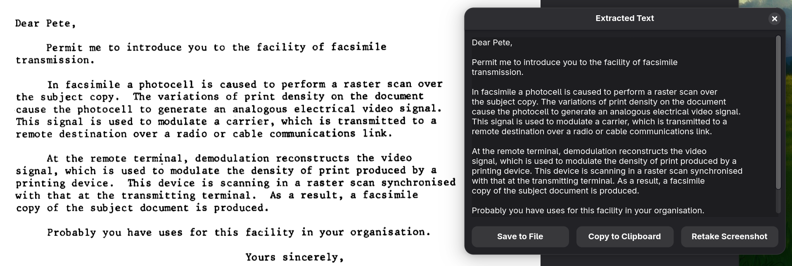

# GNOME Screenshot OCR

A simple OCR (Optical Character Recognition) tool for the GNOME desktop environment that allows you to extract text automatically from screenshots.



## Features

- Interactive screenshot selection
- Copy extracted text to clipboard
- Save extracted text to file
- Multi-language support
- GNOME desktop integration
- Customizable options
- Lightweight and minimal dependencies

## Requirements

- Python 3.x (Preinstalled on most Linux distributions)
- GTK 4 (Preinstalled on GNOME-based distributions)
- Tesseract OCR (See below for installation instructions)

## Installation

1. Install system dependencies:
```bash
# Ubuntu/Debian
sudo apt install tesseract-ocr

# Fedora
sudo dnf install tesseract
sudo dnf install python3-pytesseract

# Arch Linux
sudo pacman -S tesseract
sudo pacman -S python-pytesseract
```

2. For additional language support, install the corresponding Tesseract language packages:
```bash
# Example for hindi language support
sudo apt install tesseract-ocr-hin  # Ubuntu/Debian
sudo dnf install tesseract-langpack-hin  # Fedora
sudo pacman -S tesseract-data-hin  # Arch Linux
```

## Usage

Basic usage:
```bash
python gnome-ocr-screenshot.py
```

## Recommended Usage
Move the script to a directory in your PATH and create keyboard shortcut for quick access.

```bash
git clone https://github.com/funinkina/Gnome-OCR-Screenshot
cd Gnome-OCR-Screenshot
sudo cp gnome-screenshot-ocr.py /usr/local/bin/gnome-screenshot-ocr
# alternatively, you can create a symbolic link
ln -s gnome-screenshot-ocr.py /usr/local/bin/gnome-screenshot-ocr
sudo chmod +x ~/.local/bin/gnome-screenshot-ocr
```

### Then make keyboard shortcut in gnome control center to run the script.
1. Open GNOME settings
2. Go to Keyboard Shortcuts
3. Add a new shortcut with the command `gnome-screenshot-ocr` with the appropriate arguments (see below)
4. Assign a key combination to the shortcut, for example: `Meta+PrintScreen`. 

### Command-line Options

- `--help`: Show help message and exit.
- `--enablesaving`: Keep the screenshot file after text extraction.
- `--nocloseonaction`: Keep the application running after saving text or copying to clipboard.
- `--lang`: Specify OCR language(s) (e.g., `--lang eng+deu` for English and German). Default is all the available languages of Tesseract data installed on your system.
- `--save-location`: Set default directory for saving text files (e.g., `--save-location ~/Documents`). Default is the user's documents directory.

Example with options:
```bash
gnome-screenshot-ocr --lang eng+deu --save-location ~/Documents
```

## How It Works

1. Launch the application
2. Select an area of your screen to capture
3. The application will extract text from the selected area
4. View the extracted text in a dialog window
5. Choose to either copy the text to clipboard or save it to a file

## License

MIT License